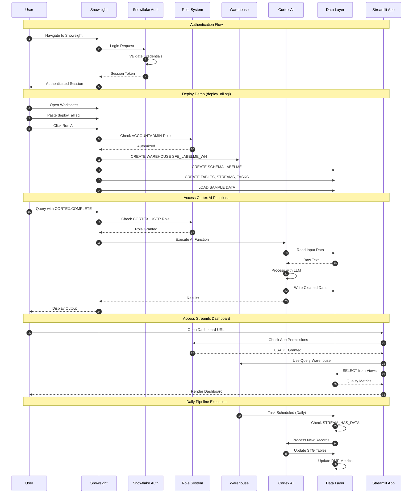

# Auth Flow - LabelMe Music Data Quality Demo

**Author:** SE Community  
**Last Updated:** 2025-12-17  
**Expires:** 2026-01-16 (30 days from creation)  
**Status:** Reference Implementation

> **Reference Implementation:** This code demonstrates production-grade architectural patterns and best practices. Review and customize security, networking, and logic for your organization's specific requirements before deployment.

## Overview

This diagram shows the authentication and authorization flow for the music label demo, including user login, demo deployment, Cortex AI access, Streamlit dashboard access, and the automated daily pipeline.

## Diagram

[Edit in Mermaid Chart Playground](https://mermaidchart.com/play)

## Component Descriptions

### Authentication Methods

| Method | Use Case | Security Level |
|--------|----------|----------------|
| **Username/Password** | Interactive login | Standard |
| **OAuth 2.0** | SSO integration | Enterprise |
| **Key-Pair** | Programmatic access | High |

### Required Roles

| Role | Purpose | Required For |
|------|---------|--------------|
| **ACCOUNTADMIN** | Initial deployment | Creating warehouse, integrations |
| **CORTEX_USER** | AI function access | CORTEX.COMPLETE, CORTEX.TRANSLATE |
| **SYSADMIN** | Object creation | Tables, views, streams, tasks |
| **PUBLIC** | Basic access | Reading views, using Streamlit |

### Authorization Flow by Action

#### Deploy Demo
1. User authenticates via Snowsight
2. System checks ACCOUNTADMIN role
3. If authorized, creates all objects
4. Grants appropriate permissions

#### Use Cortex AI
1. User executes query with Cortex function
2. System checks CORTEX_USER database role
3. If granted, executes AI function
4. Results returned to user

#### Access Streamlit
1. User opens Streamlit app URL
2. App inherits user's session context
3. System checks USAGE grant on app
4. App queries views with user's permissions

#### Automated Pipeline
1. Task triggers on schedule (daily)
2. Task executes with owner's privileges
3. Streams checked for new data
4. If data exists, Cortex processes it
5. STG tables updated

### Permission Matrix

| Object | ACCOUNTADMIN | SYSADMIN | CORTEX_USER | PUBLIC |
|--------|--------------|----------|-------------|--------|
| Warehouse | CREATE, USAGE | USAGE | USAGE | - |
| Database | CREATE | CREATE | - | - |
| Schema | CREATE | CREATE | USAGE | USAGE |
| Tables | ALL | ALL | SELECT | SELECT |
| Views | ALL | ALL | SELECT | SELECT |
| Cortex Functions | - | - | EXECUTE | - |
| Streamlit App | ALL | ALL | USAGE | USAGE |
| Tasks | ALL | ALL | - | - |

### Session Context

| Context | Source | Lifetime |
|---------|--------|----------|
| **User Session** | Snowsight login | Until logout/timeout |
| **Role** | USE ROLE statement | Duration of session |
| **Warehouse** | USE WAREHOUSE statement | Duration of session |
| **Database/Schema** | USE statement | Duration of session |

### Security Best Practices

1. **Least Privilege**: Grant minimum required permissions
2. **Role Hierarchy**: Use role inheritance for management
3. **Session Timeout**: Configure appropriate timeouts
4. **Audit Logging**: Enable ACCESS_HISTORY for compliance
5. **Network Policies**: Restrict IP ranges if needed

## Change History

See `.cursor/DIAGRAM_CHANGELOG.md` for version history.

