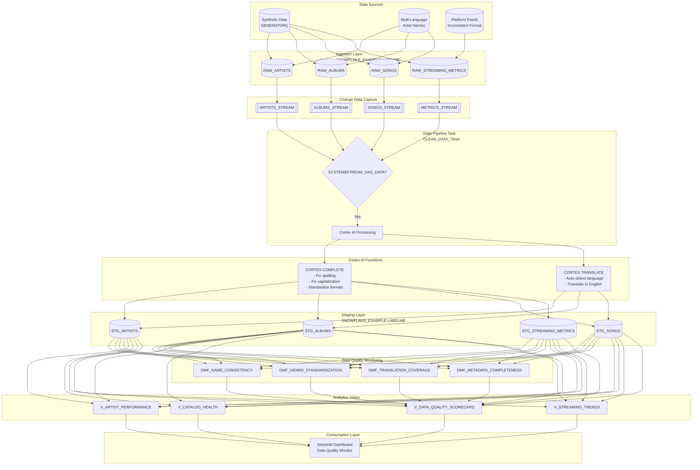

# Data Flow - LabelMe Music Data Quality Demo

**Author:** SE Community  
**Last Updated:** 2025-12-17  
**Expires:** 2026-01-16 (30 days from creation)  
**Status:** Reference Implementation

> **Reference Implementation:** This code demonstrates production-grade architectural patterns and best practices. Review and customize security, networking, and logic for your organization's specific requirements before deployment.

## Overview

This diagram shows how data flows through the music label data quality pipeline, from synthetic dirty data generation through Cortex AI cleaning to the Streamlit dashboard for quality monitoring.

## Diagram

[Edit in Mermaid Chart Playground](https://mermaidchart.com/play)

## Component Descriptions

### Data Sources

| Source | Technology | Output |
|--------|------------|--------|
| **Synthetic Data** | `GENERATOR(ROWCOUNT => n)` | 500 artists, 1500 albums, 5000 songs, 50000 metrics |
| **Multi-Language Names** | Random selection from language pools | Spanish, Japanese, French, German artist/song names |
| **Platform Feeds** | Simulated inconsistent formats | Varied platform names, region codes |

### Ingestion Layer

| Table | Records | Key Dirty Data Issues |
|-------|---------|----------------------|
| **RAW_ARTISTS** | 500 | Spelling, capitalization, country format |
| **RAW_ALBUMS** | 1,500 | Title spelling, non-English titles, label names |
| **RAW_SONGS** | 5,000 | Multi-language titles, featuring artist format |
| **RAW_STREAMING_METRICS** | 50,000 | Platform/region name variations |

### Change Data Capture

| Stream | Source Table | Purpose |
|--------|--------------|---------|
| **ARTISTS_STREAM** | RAW_ARTISTS | Track new/updated artists |
| **ALBUMS_STREAM** | RAW_ALBUMS | Track new/updated albums |
| **SONGS_STREAM** | RAW_SONGS | Track new/updated songs |
| **METRICS_STREAM** | RAW_STREAMING_METRICS | Track new metrics |

### Cortex AI Processing

| Function | Input | Output | Example |
|----------|-------|--------|---------|
| **CORTEX.COMPLETE** | "Bettles" | "Beatles" | Spelling correction |
| **CORTEX.COMPLETE** | "TAYLOR swift" | "Taylor Swift" | Capitalization fix |
| **CORTEX.TRANSLATE** | "君の名は" | "Your Name" | Japanese → English |

### Data Quality Monitoring

| DMF | Metric | Target |
|-----|--------|--------|
| **DMF_NAME_CONSISTENCY** | % names matching cleaned version | >95% |
| **DMF_GENRE_STANDARDIZATION** | % using standard genres | >90% |
| **DMF_TRANSLATION_COVERAGE** | % non-English translated | 100% |
| **DMF_METADATA_COMPLETENESS** | % required fields filled | >98% |

### Data Transformation Summary

| Stage | Input | Transformation | Output |
|-------|-------|----------------|--------|
| Ingest | Sources | INSERT with dirty data | RAW_* tables |
| CDC | RAW_* | Stream capture | Change records |
| Clean | Streams | Cortex AI processing | STG_* tables |
| Quality | STG_* | DMF evaluation | Metric scores |
| Analytics | STG_* | Aggregation | Views |
| Present | Views | Visualization | Dashboard |

## Change History

See `.cursor/DIAGRAM_CHANGELOG.md` for version history.

