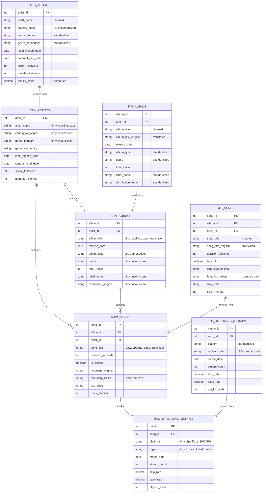

# Data Model - LabelMe Music Data Quality Demo

**Author:** SE Community  
**Last Updated:** 2025-12-17  
**Expires:** 2026-01-16 (30 days from creation)  
**Status:** Reference Implementation

> **Reference Implementation:** This code demonstrates production-grade architectural patterns and best practices. Review and customize security, networking, and logic for your organization's specific requirements before deployment.

## Overview

This diagram shows the database schema for the music label data quality demo. The model includes RAW tables (dirty source data), STG tables (cleaned data), and their relationships. All tables live in the `SNOWFLAKE_EXAMPLE.LABELME` schema.

## Diagram

[Edit in Mermaid Chart Playground](https://mermaidchart.com/play)

## Component Descriptions

### RAW Layer (Dirty Source Data)

| Table | Purpose | Data Quality Issues |
|-------|---------|---------------------|
| **RAW_ARTISTS** | Artist master data | Spelling errors, inconsistent capitalization, varied country formats |
| **RAW_ALBUMS** | Album catalog | Title misspellings, non-English titles, inconsistent label names |
| **RAW_SONGS** | Track-level data | Multi-language titles, "feat." vs "ft." variations |
| **RAW_STREAMING_METRICS** | Platform performance | Platform name variations, region code inconsistencies |

### STG Layer (Cleaned Data)

| Table | Purpose | Cleaning Applied |
|-------|---------|------------------|
| **STG_ARTISTS** | Clean artist data | Names corrected, countries standardized to ISO codes |
| **STG_ALBUMS** | Clean album data | Titles cleaned, English translations added |
| **STG_SONGS** | Clean track data | Titles cleaned, featuring artist format standardized |
| **STG_STREAMING_METRICS** | Clean metrics | Platform/region names standardized |

### Key Relationships

- **Artists → Albums**: One artist can release many albums
- **Artists → Songs**: One artist can perform many songs (direct relationship for singles)
- **Albums → Songs**: One album contains many songs
- **Songs → Metrics**: One song has many streaming metric records (by platform/region/date)

## Change History

See `.cursor/DIAGRAM_CHANGELOG.md` for version history.

