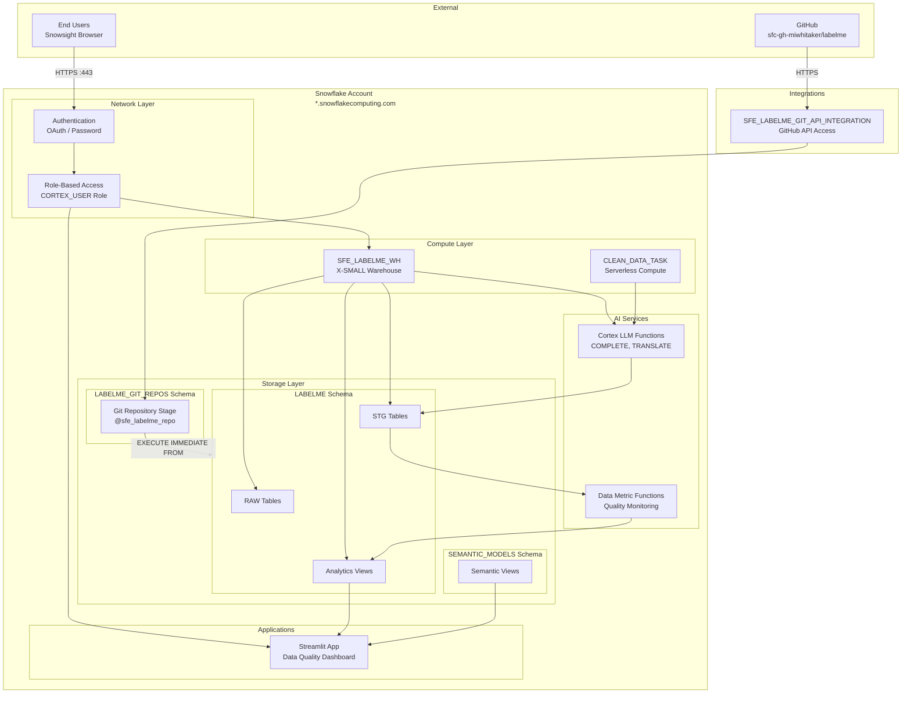

# Network Flow - LabelMe Music Data Quality Demo

**Author:** SE Community  
**Last Updated:** 2025-12-17  
**Expires:** 2026-01-16 (30 days from creation)  
**Status:** Reference Implementation

> **Reference Implementation:** This code demonstrates production-grade architectural patterns and best practices. Review and customize security, networking, and logic for your organization's specific requirements before deployment.

## Overview

This diagram shows the network architecture and component connectivity for the music label demo, including external connections (GitHub, users) and internal Snowflake services.

## Diagram

[Edit in Mermaid Chart Playground](https://mermaidchart.com/play)

## Component Descriptions

### External Systems

| System | URL | Protocol | Purpose |
|--------|-----|----------|---------|
| **Snowsight** | `app.snowflake.com` | HTTPS :443 | User interface |
| **GitHub** | `github.com/sfc-gh-miwhitaker/labelme` | HTTPS | Source repository |

### Network Layer

| Component | Technology | Function |
|-----------|------------|----------|
| **Authentication** | OAuth 2.0 / Password | User identity verification |
| **RBAC** | Snowflake Roles | Access control (CORTEX_USER required) |

### Compute Layer

| Resource | Size | Purpose |
|----------|------|---------|
| **SFE_LABELME_WH** | X-SMALL (1 credit/hr) | Query execution, Streamlit |
| **CLEAN_DATA_TASK** | Serverless | Scheduled pipeline execution |

### Storage Layer

| Schema | Contents | Purpose |
|--------|----------|---------|
| **LABELME** | RAW_*, STG_*, Views, Streams, Tasks | Main project data |
| **LABELME_GIT_REPOS** | Git repository stage | SQL script source |
| **SEMANTIC_MODELS** | Semantic views | Cortex Analyst integration |

### AI Services

| Service | Function | Endpoint |
|---------|----------|----------|
| **Cortex COMPLETE** | Text generation/correction | `SNOWFLAKE.CORTEX.COMPLETE()` |
| **Cortex TRANSLATE** | Language translation | `SNOWFLAKE.CORTEX.TRANSLATE()` |
| **Data Metric Functions** | Quality monitoring | Custom DMFs |

### Integrations

| Integration | Type | Scope |
|-------------|------|-------|
| **SFE_LABELME_GIT_API_INTEGRATION** | API Integration | `https://github.com/sfc-gh-miwhitaker/` |

## Security Boundaries

| Boundary | Protection | Notes |
|----------|------------|-------|
| **Internet → Snowflake** | TLS 1.2+ encryption | All traffic encrypted |
| **User → Data** | Role-based access | CORTEX_USER role required for AI functions |
| **GitHub → Snowflake** | API Integration | Read-only repository access |
| **Streamlit → Data** | Session context | Inherits user's role permissions |

## Ports and Protocols

| Connection | Port | Protocol | Direction |
|------------|------|----------|-----------|
| User → Snowsight | 443 | HTTPS | Inbound |
| Snowflake → GitHub | 443 | HTTPS | Outbound |
| Internal Services | N/A | Internal | Snowflake-managed |

## Change History

See `.cursor/DIAGRAM_CHANGELOG.md` for version history.

